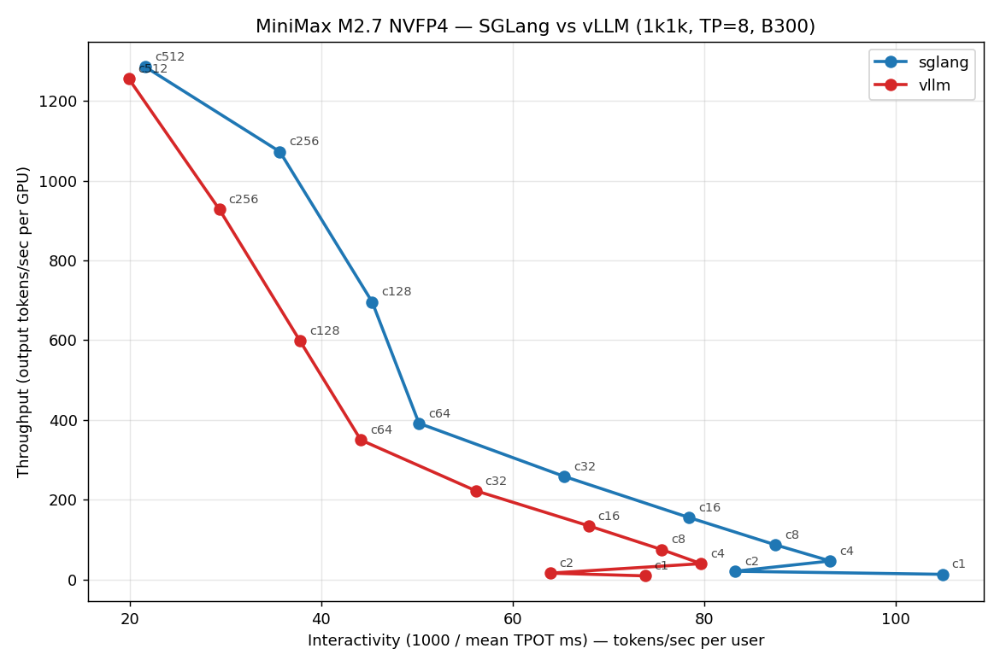
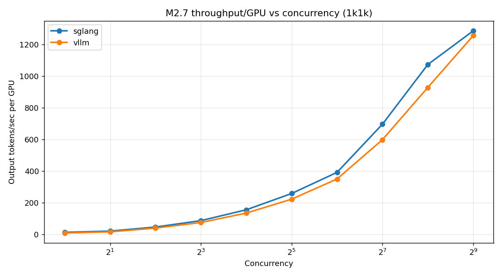
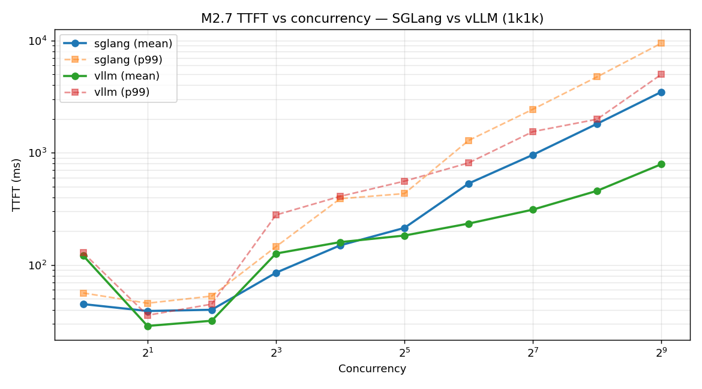
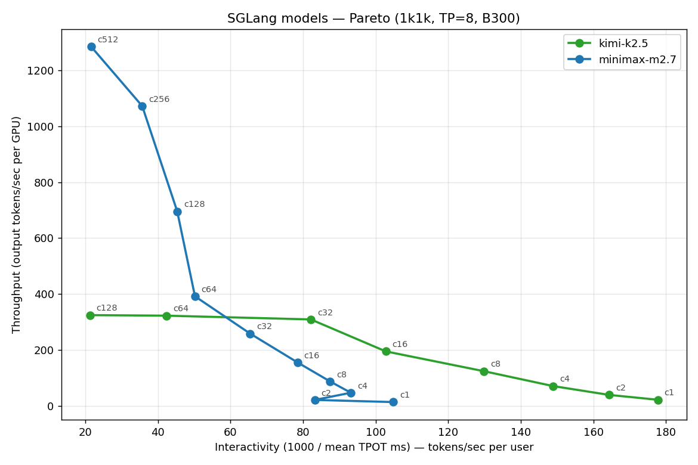
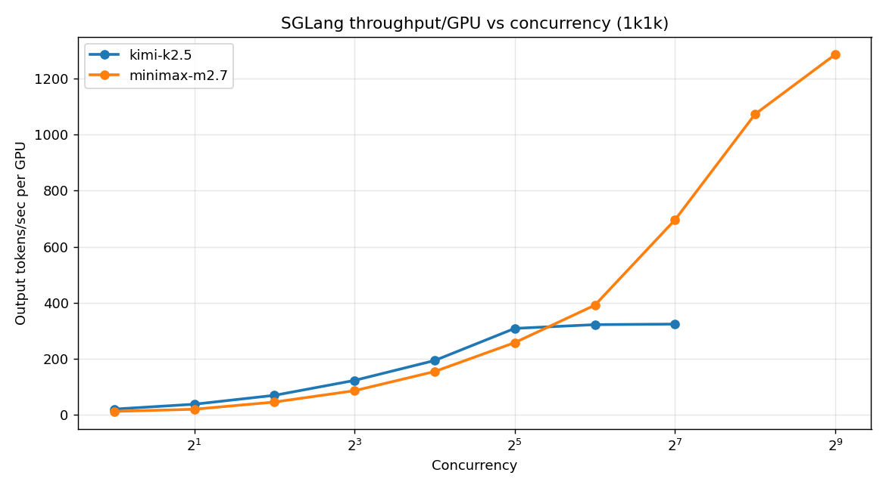
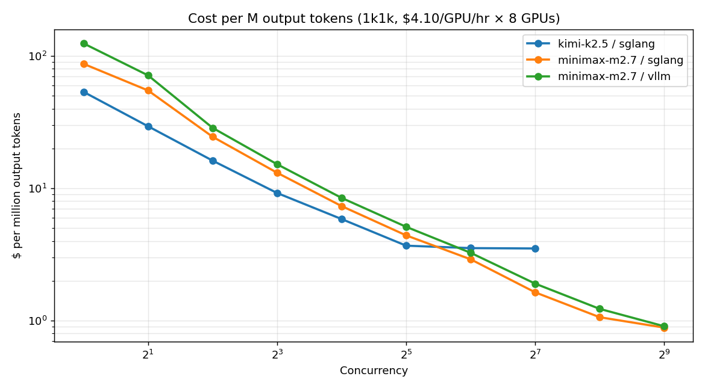

# B300 NVFP4 Inference Benchmark — Analysis Report

**Hardware:** 1 × NVIDIA B300 NVL8 node (8 × B300 SXM6 AC, 288 GB HBM3e / GPU, SM 103a, driver 590.48, CUDA 13.1)
**Precision:** NVFP4 (native 4-bit FP, Blackwell)
**Parallelism:** TP=8 (EP disabled — confirmed broken on both frameworks at this snapshot)
**Sequence profile reported here:** 1k1k (1024 in / 1024 out). 1k4k and 4k1k sweeps are pending and excluded from this report.
**Cost basis for all $ figures:** $4.10 / GPU-hour → $32.80 / node-hour.

---

## Executive Summary

- **MiniMax M2.7 (230B total / 10B active, 256 experts) serves economically on a single B300 node.** Peak sustained generation throughput is ≈1,285 output-tokens/sec/GPU on SGLang at concurrency 512, driving cost down to **$0.89 per million output tokens**. That is roughly an order of magnitude below the public API pricing of most frontier MoE models.
- **SGLang wins at low concurrency; vLLM wins at high concurrency for latency.** At conc = 1 SGLang delivers 42% more tokens/sec/GPU and 63% lower TTFT than vLLM. At conc ≥ 128, vLLM's prefill scheduler keeps TTFT ≈ 3–6× lower; the two frameworks converge on peak throughput within ~2% at conc = 512.
- **Kimi K2.5 (~1T total / 32B active) is bandwidth/KV-bound, not compute-bound, at 8 GPUs.** Throughput plateaus at ~324 tok/s/GPU by conc = 64 and cost bottoms out near **$3.51 / M-tok** — 4× more expensive per token than M2.7 at this scale. Scaling beyond 8 GPUs (or using a faster tokenizer path) is the obvious next step.
- **At 96 nodes (768 B300 GPUs), the cluster projects to:**
  - **M2.7 SGLang:** ~987K output-tok/sec sustained → **≈85 billion output tokens/day**, ~$0.89 / M-tok, cluster run-rate $75.6K/day ($27.6M/yr).
  - **Kimi K2.5 SGLang:** ~249K output-tok/sec → ~21.5 B-tok/day, ~$3.51 / M-tok on the current 8-GPU-shard configuration.

---

## Methodology

- Each run pins every prompt to exactly `random_output_len` (via `--random-range-ratio 1.0`), so reported throughput reflects true generation work, not a uniformly sampled short tail.
- Warm-up is done once per container launch via curl; subsequent concurrency sweeps reuse CUDA graphs and JIT caches.
- `num_prompts = max(concurrency × 10, 40)` — 40 is the P99 stability floor.
- Sweep is aborted on any failed request, traceback, HTTP 400, or missing JSON.
- Framework versions: **SGLang 0.5.10.post1** (`lmsysorg/sglang:latest-cu130-runtime`) and **vLLM 0.13.0** (NGC 26.01). vLLM 26.03 crashes at high concurrency on this driver; NGC 26.01 is the stable fallback.
- Cost model: `$/M-tok = (GPU-hr cost × #GPUs × 1e6) / (output_tok_s × 3600)`.

---

## 1. MiniMax M2.7 — SGLang vs vLLM (1k1k, TP=8)

### 1.1 Pareto curve

The Pareto plot (throughput/GPU on y, interactivity = 1000/TPOT on x) is the InferenceX-style summary. Each point is a concurrency level. SGLang's curve dominates across the entire low-to-mid range; the two curves meet on the upper-right at conc = 256–512 where per-GPU throughput saturates.

### 1.2 Throughput per GPU vs concurrency

SGLang holds a ~40% throughput lead all the way to conc = 256, then vLLM catches up as its scheduler amortizes prefill across the batch. Both frameworks scale nearly linearly with concurrency up to 128 and start to taper between 256 and 512.

### 1.3 TTFT vs concurrency — the SGLang prefill-scheduler bottleneck

This is the single most actionable finding for production. vLLM's TTFT grows roughly like `O(conc)` with a very shallow constant; SGLang's mean TTFT accelerates past conc = 64 and its p99 balloons to **9.5 seconds at conc = 512**, vs **5.0 seconds for vLLM**. Concrete numbers:

| Concurrency | SGLang mean TTFT | SGLang p99 TTFT | vLLM mean TTFT | vLLM p99 TTFT |
|---:|---:|---:|---:|---:|
| 1   | 45 ms    | 56 ms    | 121 ms  | 129 ms  |
| 32  | 214 ms   | 433 ms   | 183 ms  | 559 ms  |
| 128 | 959 ms   | 2441 ms  | 312 ms  | 1543 ms |
| 512 | 3484 ms  | 9463 ms  | 791 ms  | 4995 ms |

**Use-case implication:** for interactive chat at high saturation (> 64 concurrent sessions / node), **vLLM is the better TTFT pick**. For batch / offline generation, or for interactive workloads below conc ≈ 64, **SGLang is strictly better on throughput, latency, and $/token**.

### 1.4 Full M2.7 sweep

**SGLang M2.7 1k1k**

|   Conc |   tok/s/GPU |   TPOT ms |   TTFT ms |   p99 TTFT ms |   1000/TPOT |  $/M-tok |
|------:|-----------:|----------:|----------:|--------------:|-----------:|---------:|
|    1  |        13  |      9.53 |      45   |         56    |     104.9  |  $87.16  |
|    2  |        21  |     12.01 |      39   |         46    |      83.2  |  $54.85  |
|    4  |        46  |     10.73 |      40   |         53    |      93.2  |  $24.51  |
|    8  |        87  |     11.43 |      85   |        146    |      87.5  |  $13.11  |
|   16  |       155  |     12.75 |     150   |        390    |      78.5  |   $7.34  |
|   32  |       258  |     15.28 |     214   |        433    |      65.4  |   $4.41  |
|   64  |       392  |     19.91 |     533   |       1288    |      50.2  |   $2.91  |
|  128  |       696  |     22.05 |     959   |       2441    |      45.3  |   $1.64  |
|  256  |      1073  |     28.01 |    1814   |       4746    |      35.7  |   $1.06  |
|  512  |      1285  |     46.20 |    3484   |       9463    |      21.6  |   $0.89  |

**vLLM M2.7 1k1k**

|   Conc |   tok/s/GPU |   TPOT ms |   TTFT ms |   p99 TTFT ms |   1000/TPOT |  $/M-tok |
|------:|-----------:|----------:|----------:|--------------:|-----------:|---------:|
|    1  |         9  |     13.54 |     121   |        129    |      73.8  | $124.35  |
|    2  |        16  |     15.64 |      29   |         36    |      63.9  |  $71.31  |
|    4  |        40  |     12.55 |      32   |         45    |      79.7  |  $28.63  |
|    8  |        75  |     13.23 |     127   |        279    |      75.6  |  $15.19  |
|   16  |       135  |     14.71 |     160   |        409    |      68.0  |   $8.46  |
|   32  |       223  |     17.80 |     183   |        559    |      56.2  |   $5.12  |
|   64  |       350  |     22.65 |     234   |        813    |      44.2  |   $3.26  |
|  128  |       598  |     26.44 |     312   |       1543    |      37.8  |   $1.90  |
|  256  |       928  |     34.02 |     458   |       1989    |      29.4  |   $1.23  |
|  512  |      1255  |     50.15 |     791   |       4995    |      19.9  |   $0.91  |

---

## 2. Cross-model view — SGLang 1k1k

M2.7 continues to scale through conc = 512; Kimi K2.5 (~100× the active parameters / expert count and roughly 5× the weights on disk) plateaus by conc = 64. That plateau is the signature of a memory-bandwidth / KV-cache-capacity wall, not a compute wall — which is consistent with Kimi's DeepSeek-V3-class architecture and the known slow-tokenizer TTFT inflation noted in `configs/kimi-k2.5.yaml`.

**Kimi K2.5 SGLang 1k1k**

|   Conc |   tok/s/GPU |   TPOT ms |   TTFT ms |   p99 TTFT ms |   1000/TPOT |  $/M-tok |
|------:|-----------:|----------:|----------:|--------------:|-----------:|---------:|
|    1  |        21  |      5.62 |     260   |       2125    |     177.8  |  $53.51  |
|    2  |        39  |      6.08 |     387   |        609    |     164.3  |  $29.42  |
|    4  |        70  |      6.72 |     403   |        628    |     148.9  |  $16.18  |
|    8  |       124  |      7.70 |     405   |        633    |     129.9  |   $9.22  |
|   16  |       194  |      9.73 |     577   |        996    |     102.8  |   $5.86  |
|   32  |       309  |     12.17 |     799   |       1116    |      82.2  |   $3.69  |
|   64  |       322  |     23.58 |    1274   |       1897    |      42.4  |   $3.53  |
|  128  |       324  |     46.94 |    2462   |       2995    |      21.3  |   $3.51  |

---

## 3. Cost per million output tokens

Cost drops monotonically with concurrency, as expected — idle GPU time is wasted money. Two operating-point conclusions:

- **M2.7 chat-friendly sweet spot (SGLang):** conc ≈ 64–128. ~390–700 tok/s/GPU, mean TTFT < 1 s, **$1.64–$2.91 / M-tok**.
- **M2.7 batch sweet spot (either framework):** conc = 256–512. ~930–1285 tok/s/GPU, **$0.89–$1.23 / M-tok**. Choose vLLM if TTFT at this saturation matters; choose SGLang if it doesn't.
- **Kimi K2.5 at 8 GPUs:** do not push past conc ≈ 32. Throughput flatlines and p99 TTFT blows up with no compensating $ savings.

---

## 4. 96-node cluster economics (768 B300 GPUs)

Projection assumes per-GPU throughput at the sweep's peak sustained operating point scales linearly across nodes (i.e., inference is embarrassingly parallel; each node serves an independent replica). It also assumes 100% utilization.

| Model        | Framework | Profile | Peak Conc | Peak tok/s/GPU | Cluster tok/s |   M-tok/hr | B-tok/day | $/M-tok | Cluster $/hr | Cluster $/day |
|:-------------|:----------|:--------|---------:|---------------:|--------------:|-----------:|----------:|--------:|-------------:|--------------:|
| Kimi K2.5    | SGLang    | 1k1k    |      128 |            324 |      249,133  |      896.9 |     21.5  | $3.511  |       $3,149 |       $75,571 |
| MiniMax M2.7 | SGLang    | 1k1k    |      512 |           1285 |      987,249  |    3,554.1 |     85.3  | $0.886  |       $3,149 |       $75,571 |
| MiniMax M2.7 | vLLM      | 1k1k    |      512 |           1255 |      964,037  |    3,470.5 |     83.3  | $0.907  |       $3,149 |       $75,571 |

**What 85 billion M2.7 output tokens/day means in rough business terms.** At a conservative retail price of $3 / M-tok (roughly in line with frontier-open-weight inference APIs), gross revenue would be ≈$256K/day vs. $75.6K/day raw GPU cost — a 3.4× raw-gross margin before power, datacenter, networking, and customer-acquisition costs. At $1 / M-tok retail (aggressive, closer to inference commoditization pricing), gross revenue would be ≈$85K/day, roughly at break-even on GPU opex alone. Profitability is therefore a pricing / mix question, not a hardware-efficiency question — the hardware comfortably supports sub-$1 / M-tok delivery for the M2.7-class model.

**Key sensitivity:** these numbers are for 1k1k. Decode-heavy traffic (1k4k) will push the cost-per-token lower because prefill cost is amortized over more output tokens; prefill-heavy traffic (4k1k) will move it higher. Both profiles are pending and should be re-run before quoting production economics.

---

## 5. Caveats & known issues

- **EP+NVFP4 broken on both vLLM 0.13.0 and SGLang 0.5.10.post1** (different root causes). All results are TP-only. Fixing EP could unlock additional headroom on Kimi-class MoE models, but is upstream-blocked.
- **SGLang auto-disables CUTLASS MoE on B300** ("TMA descriptor initialization issues on B200, using auto backend"). Stable, but not necessarily peak perf — a `--moe-runner-backend flashinfer_trtllm` A/B is a sensible follow-up.
- **Kimi K2.5 tokenizer slow-path** inflates TTFT by 10–30% per `configs/kimi-k2.5.yaml`.
- **Driver 590.48 constrains container choice.** NGC 26.03 crashes at high concurrency; we are pinned to NGC 26.01 for vLLM until a driver upgrade.
- **Single-node projection assumes linear scaling.** Real 96-node clusters will see load-balancer overhead, KV-cache-aware routing inefficiencies, and tail latency. The projection is an upper bound, not a guarantee.
- **1k4k and 4k1k profiles are pending.** Numbers here should not be extrapolated to decode-heavy (reasoning) or prefill-heavy (RAG) workloads without the additional sweeps.

---

## Appendix A — File locations

- Raw parsed CSV: `analysis/all_runs.csv`
- Cluster economics CSV: `analysis/cluster_economics.csv`
- Per-model tables: `analysis/tables.md`
- Plots: `analysis/plots/*.png`
- Reproducer script: `analysis/analyze.py` (copy of the one used to generate this report)
