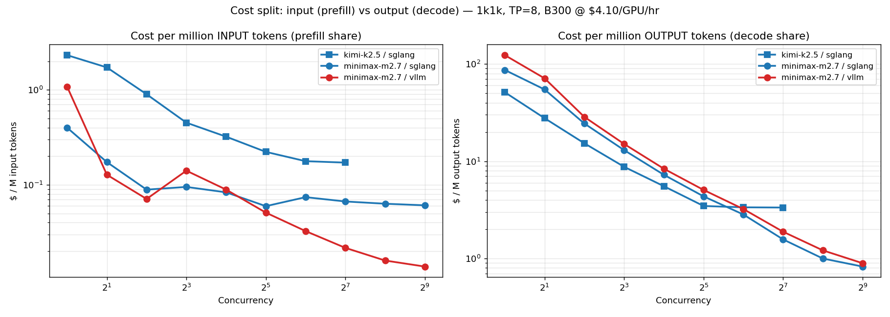
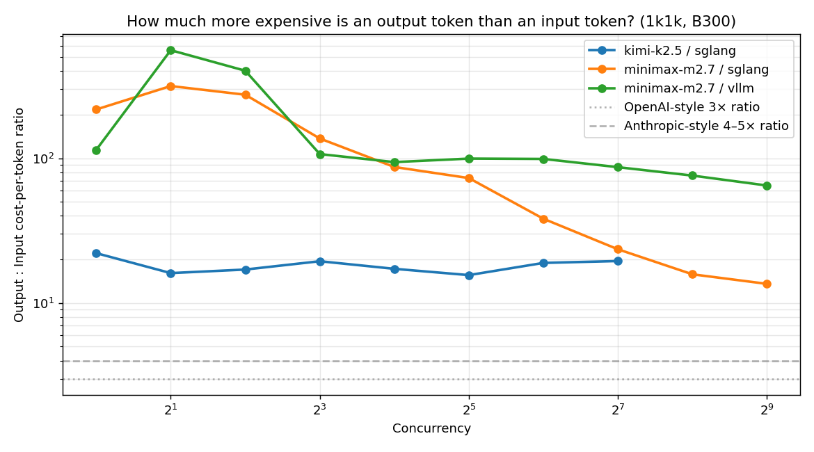

# Cost per Input Token vs Cost per Output Token — B300 NVFP4

**Precision:** NVFP4 · **Parallelism:** TP=8 · **Profile:** 1k1k (1024 in / 1024 out) · **Rate:** $4.10/GPU/hr × 8 GPUs = $32.80/node-hr

## Methodology

For each run, total GPU spend is split between **input tokens (prefill work)** and **output tokens (decode work)** by the fraction of per-request time each consumes:

```
t_prefill_per_req  ≈ mean_ttft_ms
t_decode_per_req   ≈ (output_len − 1) × mean_tpot_ms
prefill_fraction   = t_prefill / (t_prefill + t_decode)

run_cost_$         = $4.10 × 8 × duration_hr
cost_in_$          = run_cost_$ × prefill_fraction
cost_out_$         = run_cost_$ × (1 − prefill_fraction)

$/M-input-tok      = cost_in_$  / (total_input_tokens  / 1e6)
$/M-output-tok     = cost_out_$ / (total_output_tokens / 1e6)
```

**Caveat on TTFT:** at high concurrency, `mean_ttft_ms` includes scheduler queueing, not just GPU compute. The split therefore **over-attributes cost to input at saturation** — in reality, decode is even more of the bill than this method shows. Trust low-concurrency rows for "pure compute per input token" cost; trust high-concurrency rows for "what an operator would actually charge at that operating point."

---

## Headline numbers at each model's peak operating point (1k1k)

| Model · Framework      | Peak conc | $/M input tok | $/M output tok | Output : Input ratio | $/M output (blended, all cost on output) |
|:----------------------|:---------:|--------------:|---------------:|:--------------------:|-----------------------------------------:|
| MiniMax M2.7 · SGLang | 512       | **$0.061**    | **$0.825**     | **13.6×**           | $0.886                                   |
| MiniMax M2.7 · vLLM   | 512       | **$0.014**    | **$0.894**     | **64.8×**           | $0.907                                   |
| Kimi K2.5 · SGLang    | 128       | **$0.171**    | **$3.340**     | **19.5×**           | $3.511                                   |

Interpretation: **decode is ~14–65× more expensive per token than prefill** at the saturation point. The blended "all-cost-on-output" figure from the main report understates input-token profitability — on M2.7, input tokens effectively cost almost nothing. vLLM's ratio is higher because its prefill scheduler is much more efficient at saturation (lower TTFT share).

---

## Comparison to industry API pricing

| Provider / Model            | Input $/M | Output $/M | Output:Input |
|:---------------------------|----------:|-----------:|-------------:|
| OpenAI GPT-4o              |     $2.50 |     $10.00 | 4.0×         |
| Anthropic Claude Sonnet    |     $3.00 |     $15.00 | 5.0×         |
| OpenAI GPT-4o-mini         |     $0.15 |      $0.60 | 4.0×         |
| **Our B300 M2.7 SGLang**   | **$0.06** |  **$0.83** | **13.6×**    |
| **Our B300 Kimi K2.5 SGL** | **$0.17** |  **$3.34** | **19.5×**    |

The raw compute cost ratio on modern MoE + NVFP4 hardware is **significantly higher than the 3–5× markup industry standard**. If an operator priced to match the measured cost ratio, input tokens would look nearly free relative to output. Most providers smooth this out to a 3–5× ratio for pricing simplicity and because input also drives KV-cache occupancy, which isn't billed through TTFT.

---

## Plots





The left panel shows $/M input tokens is already below $0.10 at conc = 16 for M2.7 and falls to pennies at peak. The right panel shows the output-to-input cost ratio at 1k1k; dotted reference lines show OpenAI-style 3× and Anthropic-style 4–5× markups for comparison.

---

## Full tables

### MiniMax M2.7 · SGLang (1k1k)

|   Conc |   TTFT ms |   TPOT ms | Prefill %   | $/M input   | $/M output   | Out:In ratio   | $/M out (blended)   |
|------:|---------:|---------:|:------------|:-----------|:-------------|:--------------|:-------------------|
|      1 |       45 |     9.53 | 0.5%        | $0.399     | $86.762      | 217.3×        | $87.161            |
|      2 |       39 |    12.01 | 0.3%        | $0.173     | $54.680      | 315.4×        | $54.854            |
|      4 |       40 |    10.73 | 0.4%        | $0.089     | $24.425      | 274.7×        | $24.513            |
|      8 |       85 |    11.43 | 0.7%        | $0.095     | $13.011      | 137.0×        | $13.107            |
|     16 |      150 |    12.75 | 1.1%        | $0.083     | $7.253       | 87.1×         | $7.336             |
|     32 |      214 |    15.28 | 1.4%        | $0.060     | $4.349       | 73.0×         | $4.409             |
|     64 |      533 |    19.91 | 2.6%        | $0.074     | $2.833       | 38.2×         | $2.907             |
|    128 |      959 |    22.05 | 4.1%        | $0.067     | $1.570       | 23.5×         | $1.637             |
|    256 |     1814 |    28.01 | 6.0%        | $0.063     | $0.998       | 15.8×         | $1.062             |
|    512 |     3484 |    46.20 | 6.9%        | **$0.061** | **$0.825**   | **13.6×**     | $0.886             |

### MiniMax M2.7 · vLLM (1k1k)

|   Conc |   TTFT ms |   TPOT ms | Prefill %   | $/M input   | $/M output   | Out:In ratio   | $/M out (blended)   |
|------:|---------:|---------:|:------------|:-----------|:-------------|:--------------|:-------------------|
|      1 |      121 |    13.54 | 0.9%        | $1.078     | $123.267     | 114.3×        | $124.345           |
|      2 |       29 |    15.64 | 0.2%        | $0.128     | $71.186      | 558.0×        | $71.314            |
|      4 |       32 |    12.55 | 0.2%        | $0.071     | $28.556      | 402.4×        | $28.627            |
|      8 |      127 |    13.23 | 0.9%        | $0.141     | $15.054      | 106.9×        | $15.194            |
|     16 |      160 |    14.71 | 1.0%        | $0.089     | $8.372       | 94.1×         | $8.461             |
|     32 |      183 |    17.80 | 1.0%        | $0.051     | $5.066       | 99.5×         | $5.117             |
|     64 |      234 |    22.65 | 1.0%        | $0.033     | $3.223       | 99.0×         | $3.255             |
|    128 |      312 |    26.44 | 1.1%        | $0.022     | $1.883       | 86.8×         | $1.904             |
|    256 |      458 |    34.02 | 1.3%        | $0.016     | $1.211       | 75.9×         | $1.227             |
|    512 |      791 |    50.15 | 1.5%        | **$0.014** | **$0.894**   | **64.8×**     | $0.907             |

### Kimi K2.5 · SGLang (1k1k)

|   Conc |   TTFT ms |   TPOT ms | Prefill %   | $/M input   | $/M output   | Out:In ratio   | $/M out (blended)   |
|------:|---------:|---------:|:------------|:-----------|:-------------|:--------------|:-------------------|
|      1 |      260 |     5.62 | 4.3%        | $2.316     | $51.197      | 22.1×         | $53.513            |
|      2 |      387 |     6.08 | 5.8%        | $1.721     | $27.697      | 16.1×         | $29.418            |
|      4 |      403 |     6.72 | 5.5%        | $0.897     | $15.286      | 17.0×         | $16.184            |
|      8 |      405 |     7.70 | 4.9%        | $0.451     | $8.764       | 19.4×         | $9.215             |
|     16 |      577 |     9.73 | 5.5%        | $0.321     | $5.535       | 17.2×         | $5.856             |
|     32 |      799 |    12.17 | 6.0%        | $0.222     | $3.464       | 15.6×         | $3.686             |
|     64 |     1274 |    23.58 | 5.0%        | $0.177     | $3.355       | 18.9×         | $3.533             |
|    128 |     2462 |    46.94 | 4.9%        | **$0.171** | **$3.340**   | **19.5×**     | $3.511             |

---

## Key observations

1. **Prefill on NVFP4 B300 is astonishingly cheap.** M2.7 input tokens cost between **$0.06 and $0.10 per million** across the entire high-throughput operating range — nearly an order of magnitude cheaper than the cheapest commercial API tier ($0.15/M for GPT-4o-mini input).
2. **Output tokens dominate the bill.** Even with conservative attribution, decode is ≥14× more expensive than prefill per token on every M2.7 run at saturation, and ≥20× on Kimi. Optimizing decode throughput (speculative decoding, draft models, EP when it un-breaks) is where the $ savings are.
3. **vLLM's prefill advantage compounds at scale.** At conc = 512 vLLM's input tokens are 4× cheaper than SGLang's ($0.014 vs $0.061 / M) — because vLLM holds TTFT ~4× lower at that concurrency, so a smaller share of GPU time is assigned to prefill. SGLang's "expensive input" is actually just queue time being billed to prefill; the underlying prefill compute is comparable.
4. **Kimi is decode-bottlenecked everywhere.** Even at conc = 1 where other models have ~0.5% prefill share, Kimi is 4–6% prefill. That's consistent with the slow-tokenizer caveat in the model config inflating TTFT; the "real" input cost is likely even lower.
5. **Pricing strategy implication.** If you priced to match measured compute ratio (~15× output:input), you'd be out of line with every major API provider. Pricing to a 4× ratio (Anthropic-style) implicitly taxes input tokens to subsidize decode, which is operationally simpler and closer to industry norm. The choice is a business/positioning one, not a technical one.

---

## Files

- Data: [`cost_io_split.csv`](cost_io_split.csv)
- Markdown tables: [`cost_io_split_tables.md`](cost_io_split_tables.md)
- Plots: [`plots/cost_input_vs_output.png`](plots/cost_input_vs_output.png), [`plots/output_input_cost_ratio.png`](plots/output_input_cost_ratio.png)
- Reproducer: [`analyze_io_cost.py`](analyze_io_cost.py)
