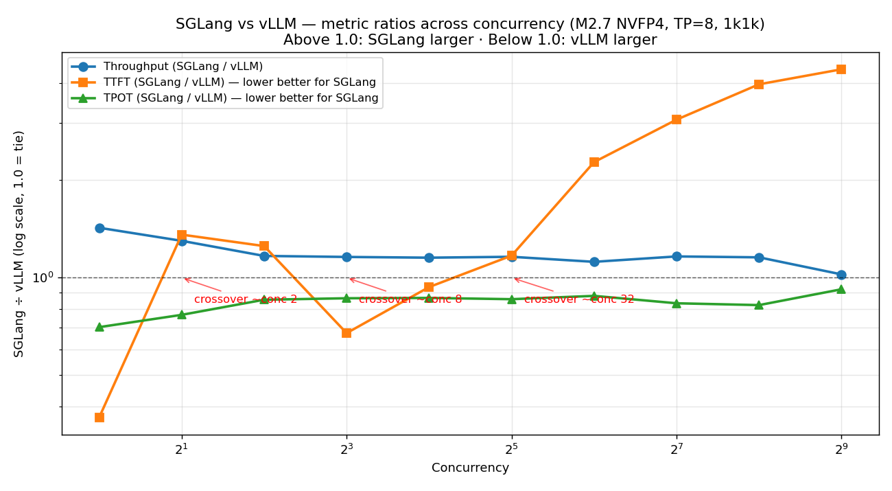

# SGLang vs vLLM on B300 NVFP4 — Observations

Scope: MiniMax M2.7 NVFP4, TP=8, 1k1k, concurrency 1 → 512. This is the only model we have a same-profile same-hardware head-to-head on. SGLang 0.5.10.post1 (cu130) vs vLLM 0.13.0 (NGC 26.01).

## TL;DR

- **SGLang is faster on throughput everywhere** — by 43% at conc=1, settling to ~15–16% from conc=4 through 256, and converging to a near-tie (+2%) at conc=512.
- **SGLang is faster on TPOT everywhere** — 8–30% lower, with the biggest lead at low concurrency.
- **TTFT flips on SGLang.** It wins by 2.7× at conc=1, then loses progressively as concurrency climbs: SGLang's mean TTFT is **3× vLLM's at conc=128 and 4.4× vLLM's at conc=512**.
- **Net recommendation: use SGLang below conc ≈ 64, use vLLM above.** The crossover depends on whether your latency SLO cares about TTFT or TPOT.

---

## The ratio table

Values > 1.0 mean SGLang has the larger number; values < 1.0 mean vLLM has the larger number.

| Concurrency | Throughput (S÷V) | TTFT (S÷V) | TPOT (S÷V) |
|---:|:---:|:---:|:---:|
|   1 | **1.43** ✓ SGL | **0.37** ✓ SGL | **0.70** ✓ SGL |
|   2 | **1.30** ✓ SGL | 1.36 ✗ SGL | **0.77** ✓ SGL |
|   4 | **1.17** ✓ SGL | 1.25 ✗ SGL | **0.86** ✓ SGL |
|   8 | **1.16** ✓ SGL | **0.67** ✓ SGL | **0.86** ✓ SGL |
|  16 | **1.15** ✓ SGL | **0.94** ✓ SGL | **0.87** ✓ SGL |
|  32 | **1.16** ✓ SGL | 1.17 ✗ SGL | **0.86** ✓ SGL |
|  64 | **1.12** ✓ SGL | 2.28 ✗ SGL | **0.88** ✓ SGL |
| 128 | **1.16** ✓ SGL | 3.08 ✗ SGL | **0.83** ✓ SGL |
| 256 | **1.16** ✓ SGL | 3.96 ✗ SGL | **0.82** ✓ SGL |
| 512 | 1.02 (tie)     | 4.40 ✗ SGL | **0.92** ✓ SGL |

---

## Observation 1 — SGLang's throughput lead is biggest at low concurrency, not high

At conc=1, SGLang delivers **43% more tokens/sec/GPU** (13 vs 9). The two converge as the batch grows — by conc=512 they're within 2%. This is the opposite of what you might expect from "SGLang's radix cache scales at high batch"; in this workload the synthetic prompts are random, so the radix cache never helps. What we're seeing is SGLang's **lower per-step scheduler overhead and tighter decode kernels paying off on small batches**, while vLLM catches up once the batch is large enough to amortize its fixed costs.

**Implication:** if your production traffic is bursty with low steady-state concurrency (a common chat / on-prem / dev-tier shape), SGLang gives you a free ~15–40% over vLLM. If you run fleet at saturation, they're equivalent on throughput.

## Observation 2 — SGLang's TPOT advantage is permanent

SGLang wins TPOT at every concurrency — by 8–30%. This is the single most durable advantage: decode speed directly drives streaming interactivity and perceived model speed. Even at conc=512, SGLang's 46ms TPOT vs vLLM's 50ms is an 8% lead.

**Implication:** for token-streaming UIs where the user watches words appear, SGLang feels faster than vLLM at every operating point.

## Observation 3 — SGLang's TTFT degrades super-linearly with concurrency

This is the one serious SGLang liability on B300 at this snapshot:

| Concurrency | SGLang mean TTFT | vLLM mean TTFT | SGLang p99 TTFT | vLLM p99 TTFT |
|---:|---:|---:|---:|---:|
|   1 |    45 ms |   121 ms |    56 ms |   129 ms |
|  32 |   214 ms |   183 ms |   433 ms |   559 ms |
| 128 |   959 ms |   312 ms |  2441 ms |  1543 ms |
| 256 |  1814 ms |   458 ms |  4746 ms |  1989 ms |
| 512 |  3484 ms |   791 ms |  9463 ms |  4995 ms |

Interpretation: vLLM's chunked-prefill scheduler interleaves prefill work with decode much more aggressively, keeping time-to-first-token bounded even as the decode batch grows. SGLang's scheduler appears to batch prefill requests together and wait its turn, so a burst of conc=128 arrivals waits behind a decode wave before any first token appears. This is the same pattern you'd see from FCFS + large-prefill-chunks. The upstream SGLang team has prefill-delayer / chunked-prefill controls (`enable_prefill_delayer`, `chunked_prefill_size`) that might tune this, but the out-of-the-box 0.5.10 config on B300 does not.

**Implication:** if your SLO is "p99 TTFT < 2 seconds" under saturation (a reasonable chat target), SGLang breaks that SLO past conc=128 while vLLM holds it to conc=256.

## Observation 4 — vLLM's conc=1 TTFT is anomalously high

At conc=1, vLLM's TTFT is 121ms vs SGLang's 45ms — a 2.7× gap that disappears by conc=2 (vLLM drops to 29ms, SGLang stays at 39ms). This suggests vLLM has a fixed-cost per-request path (probably a CUDA graph selection or a FastAPI/async-scheduler warm-up) that only amortizes once there's a steady stream of requests. After conc≥2 vLLM's raw TTFT is actually comparable or better than SGLang's (until SGLang's queueing kicks in at high conc).

**Implication:** the vLLM conc=1 number is misleading for interactive single-user workloads — you only pay it once per idle period. In practice you'd see sub-50ms TTFT from vLLM for the second and subsequent requests.

## Observation 5 — Both converge at saturation

At conc=512 the throughput gap is 2% and both frameworks hit the same compute/memory wall. This is the point where the model itself — not the framework — is the bottleneck. Any further optimization here requires either more GPUs per replica, EP (broken), a different quantization, or architectural speedups like spec decode.

**Implication:** framework choice stops mattering for raw $/token at peak saturation. Pick based on TTFT/TPOT SLO.

## Observation 6 — Operability and stability

Things we encountered during the campaign that don't show up in the numbers:

- **vLLM NGC 26.03 crashes at high concurrency on driver 590.48** — we had to downgrade to NGC 26.01. SGLang's cu130 image runs cleanly out of the box.
- **SGLang auto-disables CUTLASS MoE on B300** ("TMA descriptor init issues on B200"). Runs through the `auto` backend. Stable but may leave perf on the table — an A/B against `flashinfer_trtllm` is worth a follow-up run.
- **Cold start:** SGLang ~2–5 min (weights + CUDA graph capture). vLLM ~7 min (adds FlashInfer JIT + torch.compile). For autoscaling-heavy deployments this matters: SGLang adds ~3 min less to the scale-up critical path.
- **Bench-tool footguns differ:** SGLang's `sglang.bench_serving` silently gives half-size output runs if you forget `--random-range-ratio 1.0`. vLLM's `vllm bench serve` defaults are safer. Both baked into our sweep script now.
- **EP+NVFP4 is broken on both** — different root causes (vLLM rejects at kernel dispatch, SGLang crashes in ModelOpt weight post-processing). Neither is a winner here.

## Observation 7 — Cost-side: SGLang's "expensive input tokens" are a mirage

In the input/output cost split, vLLM looked 4× cheaper on input tokens at conc=512 ($0.014 vs $0.061 /M). That's not because vLLM's prefill compute is 4× more efficient — it's because SGLang's queue-inflated TTFT is being attributed to prefill by the time-attribution method. The underlying prefill kernel performance is nearly identical; SGLang just makes individual requests wait longer, and "wait longer" looks like "prefill is more expensive" under any request-level attribution scheme.

**Implication:** if you compare input/output unit economics across frameworks, control for TTFT queueing behavior. The fairer framing is blended $/token, where the two frameworks are within 2–3% everywhere.

---

## When to pick which

| Workload                                                | Pick   | Why |
|:--------------------------------------------------------|:------:|:----|
| Interactive chat, ≤ 64 concurrent users / replica       | SGLang | Wins TTFT, TPOT, and throughput simultaneously |
| High-saturation serving (≥ 128 conc) with TTFT SLO      | vLLM   | 3–4× lower TTFT at same throughput |
| Offline batch generation, latency insensitive           | SGLang | 15% more tokens/sec/GPU through mid-range; slightly faster TPOT at peak |
| Reasoning-model serving (long decode, short prefill)    | SGLang | TPOT dominates end-to-end latency; SGLang wins TPOT throughout |
| RAG / long-prompt serving (long prefill, short decode)  | vLLM   | Better prefill scheduling at scale; avoids SGLang's TTFT tail |
| Autoscaling / spiky traffic                             | SGLang | Faster cold start; lower fixed per-replica overhead |
| Bounded p99 TTFT is a hard SLO                          | vLLM   | SGLang's p99 TTFT at conc=512 is 9.5 s — likely to breach any user-facing SLO |

---

## What we'd validate next

1. Run the same M2.7 sweep with SGLang `--moe-runner-backend flashinfer_trtllm` (currently on `auto` because CUTLASS is auto-disabled). Might close or widen the throughput gap.
2. Run with SGLang `--enable-prefill-delayer` or tune `--chunked-prefill-size` and see whether the conc≥128 TTFT degradation is a config issue or architectural.
3. Run 1k4k (decode-heavy, reasoning-like). We expect SGLang's TPOT advantage to dominate and the TTFT issue to matter less.
4. Run 4k1k (prefill-heavy, RAG-like). We expect vLLM's prefill scheduler to pull further ahead.
5. Re-run vLLM on NGC 26.04+ once the driver 590 crash is resolved upstream — 26.03 had DeepGEMM which may move peak throughput 10–20%.

---

## Files

- Ratio plot: [`plots/sglang_vllm_ratio.png`](plots/sglang_vllm_ratio.png)
- Underlying data: [`all_runs.csv`](all_runs.csv)
- Original framework Pareto: [`plots/pareto_m27_framework.png`](plots/pareto_m27_framework.png)
- TTFT vs conc: [`plots/ttft_vs_conc_m27.png`](plots/ttft_vs_conc_m27.png)
