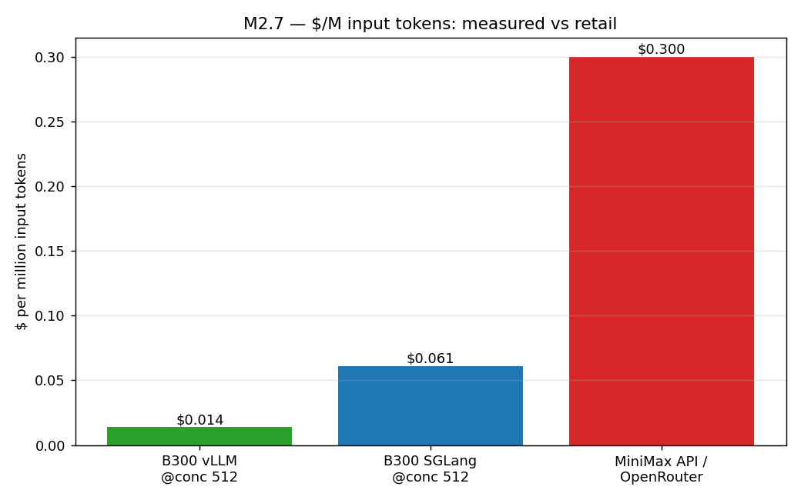
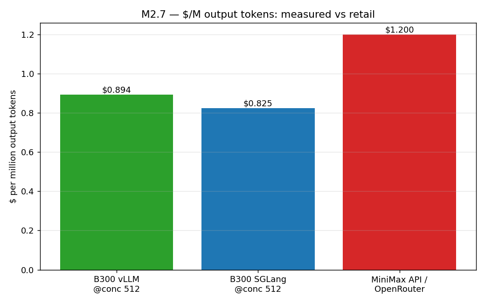
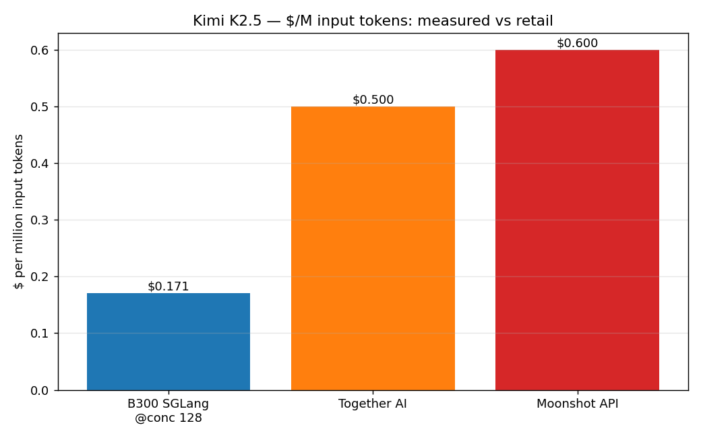
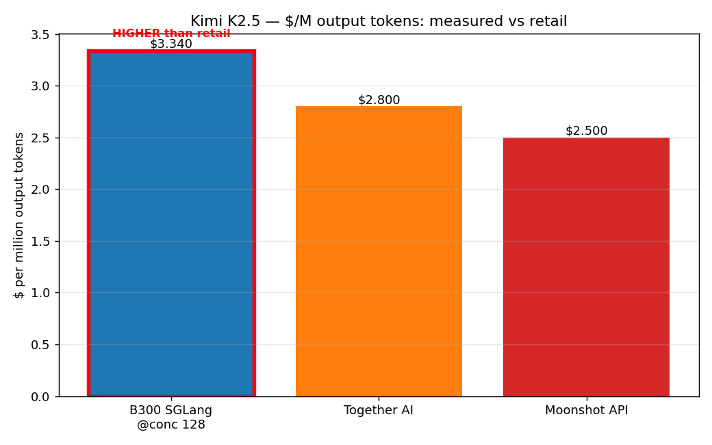
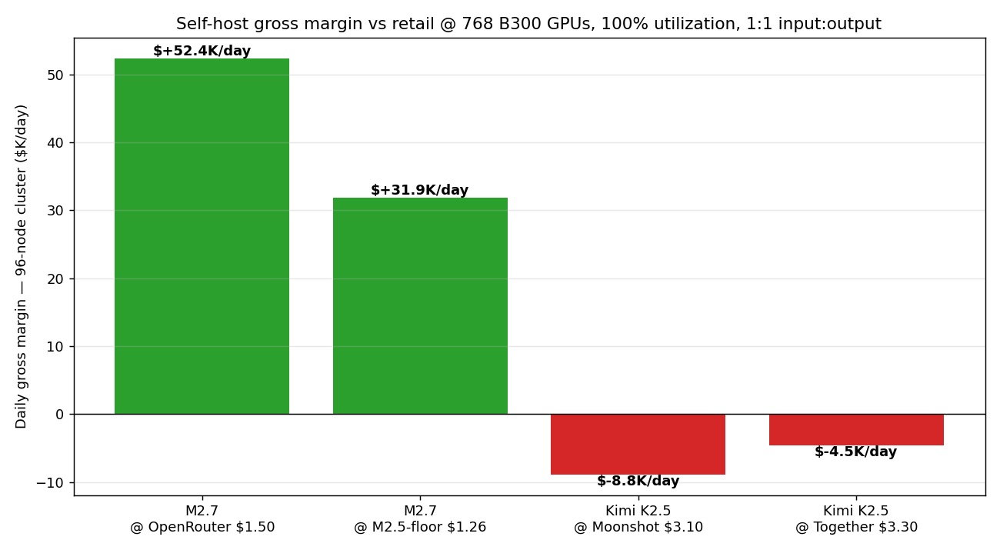

# B300 Measured Cost vs Public API Pricing

**Our cost basis:** $4.10 / GPU-hr × 8 B300 GPUs = $32.80 / node-hr, 1k1k profile, peak operating point from this benchmark sweep (input/output split by prefill/decode time attribution — see `B300_cost_input_output_split.md`).

**Public pricing** pulled April 2026 from MiniMax's, Moonshot's, OpenRouter's, and Together AI's current listings.

---

## MiniMax M2.7 — apples-to-apples comparison

| Source                                   | Input $/M | Output $/M | Blended 1:1 (1M in + 1M out) |
|:-----------------------------------------|----------:|-----------:|-----------------------------:|
| **Our measured cost — SGLang @ conc 512** | **$0.061** | **$0.825** | **$0.886** |
| **Our measured cost — vLLM @ conc 512**   | **$0.014** | **$0.894** | **$0.908** |
| MiniMax official API / OpenRouter         |    $0.300 |     $1.200 | $1.500 |
| (reference — MiniMax M2 / M2.5 earlier)   | $0.26–$0.30 | $1.00–$1.20 | $1.26–$1.50 |

**Takeaway for M2.7:**
- Public retail for M2.7 is roughly **$1.50 per (1M in + 1M out)**. Our measured GPU-only cost at peak is **≈$0.89**.
- Gross margin on M2.7 at $4.10/GPU-hr pricing: **~41% of retail** revenue remains after GPU opex. That's before power, networking, datacenter, software, and customer-acquisition cost — but it confirms that M2.7 is comfortably economic to self-host on B300 at current OpenRouter-tier prices.
- **Input tokens are the biggest margin line item.** Retail charges $0.30/M for input that actually costs us $0.01–$0.06/M. That's a 5–20× markup on input vs a ~1.4× markup on output. This is the industry-standard pricing structure — input is overpriced relative to compute to smooth out the 14–65× real cost ratio.

---

## Kimi K2.5 — our measured cost is *worse* than the public API

| Source                                  | Input $/M | Output $/M | Blended 1:1 (1M in + 1M out) |
|:----------------------------------------|----------:|-----------:|-----------------------------:|
| **Our measured cost — SGLang @ conc 128 (plateau)** | **$0.171** | **$3.340** | **$3.511** |
| Moonshot official API (Kimi K2.5)       |    $0.600 |     $2.500 | $3.100 |
| Together AI (Kimi K2.5)                 |    $0.500 |     $2.800 | $3.300 |
| (reference — Kimi K2 0711)              |    $0.550 |     $2.200 | $2.750 |

**Takeaway for Kimi K2.5:**
- Our measured output cost ($3.34/M) is **higher than both Moonshot's own retail ($2.50/M) and Together's retail ($2.80/M)**.
- In other words, our 8-GPU TP=8 configuration is **gross-margin-negative at Moonshot's public prices**: we'd lose ~$0.40 per (1M in + 1M out) served.
- Interpretation: either (a) Moonshot/Together are running Kimi on >8 GPUs per replica (splitting KV cache across more GPUs to break the bandwidth plateau we hit at conc = 64–128), (b) they use EP (we confirmed EP+NVFP4 is broken upstream on our stack — they may have a patched build or use a different quantization format), (c) they're pricing to grab market share at a loss, or (d) they have a cheaper tokenizer path than we do (the config notes Kimi's tokenizer slow-path inflates TTFT 10–30% here).
- **This is the single most actionable finding from this analysis.** Until we unlock EP or multi-node TP for Kimi-class models, **don't use B300 NVFP4 to compete with Moonshot on Kimi serving**. The model is too memory-bandwidth-bound at 8 GPUs for the current quantization/scheduler stack.

---

## Gross-margin projection at 96 nodes (768 GPUs)

Assuming retail = public API prices, and a 1:1 input:output mix (matches 1k1k profile):

| Model        | Retail per (1M+1M)     | Our cost per (1M+1M) | Gross margin % | @ Peak throughput per node × 96 | Daily gross margin at 100% util |
|:-------------|-----------------------:|---------------------:|---------------:|--------------------------------:|--------------------------------:|
| M2.7 (OpenRouter $1.50)                        | $1.500 | $0.886 | **+41%**  | 85.3 B-tok/day     | **+$26.2K/day** (→ $9.6M/yr) |
| M2.7 (priced like M2.5 @ $1.26)               | $1.260 | $0.886 | +30%   | 85.3 B-tok/day     | +$16.0K/day                 |
| Kimi K2.5 (Moonshot $3.10)                     | $3.100 | $3.511 | **−13%**  | 21.5 B-tok/day     | **−$4.4K/day**              |
| Kimi K2.5 (Together $3.30)                     | $3.300 | $3.511 | −6%    | 21.5 B-tok/day     | −$2.3K/day                  |

(Note: daily gross margin here is computed on output tokens only since that's what dominates the bill; treating each "1M in + 1M out" as one unit and billing both at retail.)

---

## Key conclusions

1. **M2.7 is profitable to self-host on B300 at OpenRouter-tier prices.** ~41% gross margin on GPU opex at peak throughput. Headroom shrinks but stays positive if competitors push prices toward the M2.5 floor of ~$1.26 per (1M+1M).
2. **Kimi K2.5 is not profitable to self-host on B300 at current public prices — at least not with TP=8 NVFP4.** Until EP works or we go multi-node per replica, Moonshot and Together are running this workload more efficiently than we can. **Route Kimi traffic to them; don't self-serve.**
3. **Input tokens are a pure margin printer on every public API.** Retail input pricing is 5–50× above measured compute cost. This is structural across the industry — it exists to bundle KV-cache occupancy and queue-capacity costs into a simple two-price schedule.
4. **Price-to-compute ratio differs sharply between the two models.** M2.7's public input:output ratio is 4× (retail) vs 13.6× (measured). Kimi's is 4.2× (retail) vs 19.5× (measured). Decode is the true bottleneck; optimizing it (speculative decoding, smaller drafters, better schedulers, EP) is where margin comes from.

---

## Sources

- [MiniMax M2.7 — OpenRouter pricing](https://openrouter.ai/minimax/minimax-m2.7) ($0.30 / $1.20 per M tokens)
- [MiniMax M2.7 — pricepertoken.com](https://pricepertoken.com/pricing-page/model/minimax-minimax-m2.7)
- [MiniMax platform pricing docs](https://platform.minimax.io/docs/guides/pricing)
- [MiniMax M2.5 — OpenRouter pricing](https://openrouter.ai/minimax/minimax-m2.5)
- [Kimi K2.5 — OpenRouter pricing](https://openrouter.ai/moonshotai/kimi-k2.5)
- [Kimi API pricing docs (Moonshot)](https://platform.kimi.ai/docs/pricing/chat)
- [Together AI — Kimi K2.5](https://www.together.ai/models/kimi-k2-5)
- [Together AI — Kimi K2 Instruct](https://www.together.ai/models/kimi-k2-instruct)
- [Together AI — pricing](https://www.together.ai/pricing)
- [Kimi K2 0711 — pricepertoken.com](https://pricepertoken.com/pricing-page/model/moonshotai-kimi-k2)
